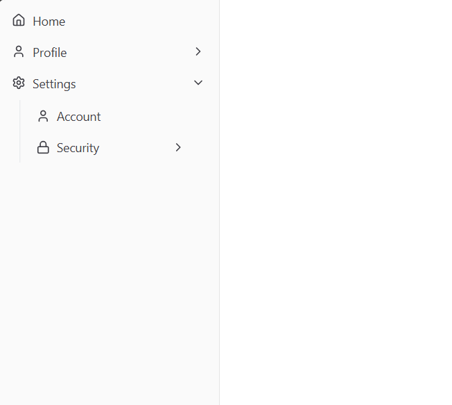

# 📂 React Recursive Sidebar Component

A highly flexible, recursive sidebar component built with **React 19**, **Tailwind CSS 4**, and **Shadcn UI**. It supports infinite nesting of navigation items with icons and collapsible groups, offering a premium navigation experience for modern web applications.



## 🚀 Live Demo

Check out the live demo here: [Live Demo](https://react-sidebar-component-pages.dev/)

## ✨ Features

- 🔄 **Recursive Rendering**: Support for infinite nesting depths using a clean, recursive `TreeItem` architecture.
- 🎨 **Premium Aesthetics**: Modern, sleek design powered by **Shadcn UI** and **Tailwind CSS 4**.
- 🧩 **Modular Components**: Separation of concerns between data, types, and UI components.
- ⚡ **React 19 Ready**: Optimized for the latest React features and concurrent rendering.
- 🛠️ **Fully Typed**: Comprehensive **TypeScript** interfaces for robust development and auto-completion.
- 📱 **Responsive Design**: Adapts seamlessly to different screen sizes via `SidebarProvider`.

## 🛠️ Built With

- **React 19**
- **TypeScript**
- **Tailwind CSS 4**
- **Vite**
- **Shadcn UI** (Radix UI Primitives)
- **Lucide React**

## 🏁 Getting Started

### Prerequisites

- Node.js (Latest LTS recommended)
- npm or yarn

### Installation

1. **Clone the repository**

   ```bash
   git clone https://github.com/your-username/react-sidebar-component.git
   ```

2. **Install dependencies**

   ```bash
   npm install
   ```

3. **Run the development server**
   ```bash
   npm run dev
   ```

## 📖 Documentation

### Usage Example

```tsx
import Sidebar from "./components/sidebar";
import navItems from "./components/sidebar/data";
import { SidebarProvider } from "@/components/ui/sidebar";

const App = () => {
  return (
    <SidebarProvider>
      <div className="flex min-h-screen w-full">
        <Sidebar navItems={navItems} />
        <main className="flex-1 p-6">
          <h1 className="text-2xl font-bold">Dashboard Content</h1>
        </main>
      </div>
    </SidebarProvider>
  );
};

export default App;
```

### Prop Documentation

#### `Sidebar` Props

| Prop       | Type        | Default | Description                           |
| :--------- | :---------- | :------ | :------------------------------------ |
| `navItems` | `NavItem[]` | `[]`    | Array of navigation items to display. |

#### `NavItem` Object

| Property   | Type         | Description                                    |
| :--------- | :----------- | :--------------------------------------------- |
| `label`    | `string`     | The display text for the navigation item.      |
| `to`       | `string`     | The target URL or route.                       |
| `icons`    | `LucideIcon` | Optional icon component from Lucide React.     |
| `children` | `NavItem[]`  | Optional array of nested sub-navigation items. |

### 📂 Project Structure

```text
src/
├── components/
│   ├── sidebar/
│   │   ├── data.tsx    # Navigation data & NavItem Interface
│   │   └── sidebar.tsx # Sidebar & Recursive TreeItem Logic
│   └── ui/             # Shadcn UI Base Components
├── lib/
│   └── utils.ts        # Utility functions (cn, etc.)
├── App.tsx             # Application Root
└── main.tsx            # Entry Point
```
